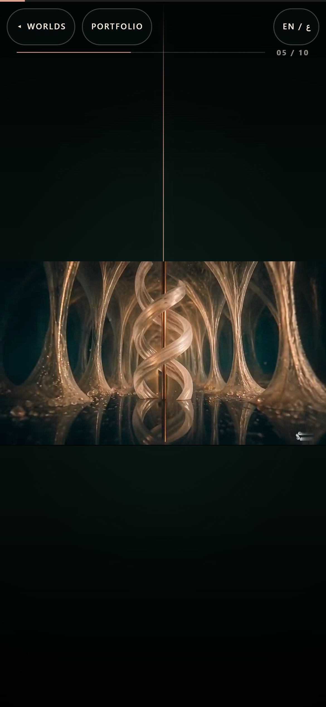
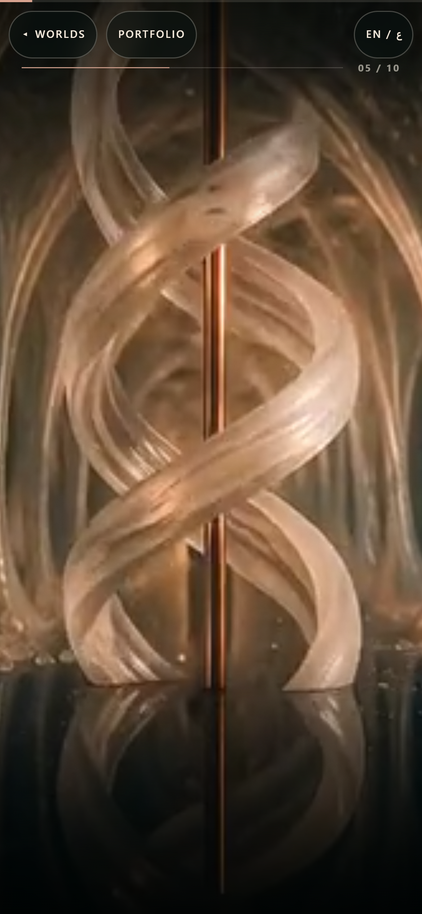
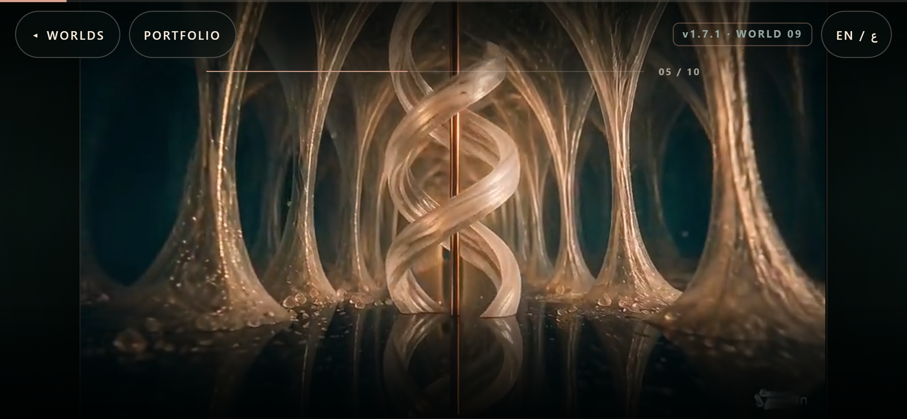
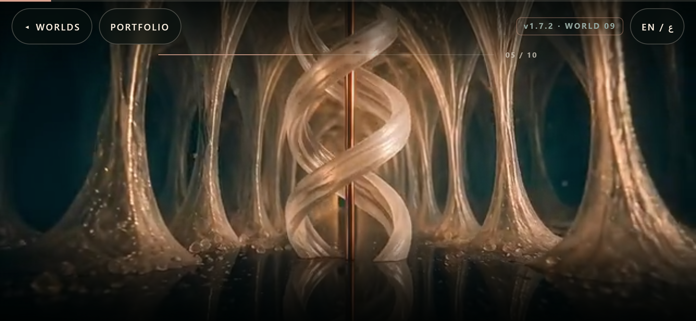

# Cake Studio phone-orientation full bleed

**What:** Cake Studio now stays full-bleed when a phone rotates between portrait and landscape without losing its scroll-scrub position.

**Proof:** The live gate returned `CAKE_ORIENTATION_GREEN failures=0`; 72-step forward and reverse traversals passed at 390×844 and 844×390 with zero measured bars or browser/network errors.

**Boundary:** Verified in Chrome DPR3/touch/coarse emulation at the owner-named viewports, not on a physical handset.

**Shots:** `01-live-landscape-before-after.png` — the same deployed I05 frame shows ~75.33 px side bars before and exact 844×390 media/viewport bounds after.

**LinkedIn paste:** I shipped a measured phone-orientation repair for the Cake Studio scroll film: full-bleed portrait and landscape, preserved mid-scroll rotation state, 15 decoded joins, and byte-range delivery verified on the public site.

**Surfaces:** [ ] showcase-pdf [ ] resume [x] website [ ] linkedin [ ] none-needed

Date: 2026-08-21

World: `worlds/cake-studio.html`

Branch: `fix/cake-landscape-bleed`

## Outcome

**VERIFIED:** the deployed page reproduced the defect at the same I05 scene with DPR 3, touch, and a coarse pointer.

- Portrait `390 x 844`: the stage was `390 x 844`, but the visible media was only `390 x 219.375`, leaving `312.3125 px` top and bottom bars.
- Landscape `844 x 390`: the stage was `844 x 390`, but the visible media was only `693.328 x 389.984`, leaving about `75.33 px` on both sides.
- The pre-fix main-source gate was RED with `CAKE_ORIENTATION_RED failures=18`.

The phone-only contract now makes the bookend aperture and 50-shot film frame exactly `100dvw x 100dvh`, uses centered `object-fit: cover`, and removes the phone aspect-ratio box. Desktop retains the approved contained v1.7 presentation.

Mid-scroll rotation now preserves the active pinned scene's normalized progress, remeasures after viewport reflow, restores the corresponding scroll offset, and dispatches a repaint through the existing scroll bus.

## Same-scene before/after

| Orientation | Deployed before — RED | Built after — GREEN |
| --- | --- | --- |
| Portrait `390 x 844` |  |  |
| Landscape `844 x 390` |  |  |

**[INFERRED]:** visual inspection of the rendered opening, seam, and ending set confirms that the story-critical subject remains centered in both crops. The geometry gate independently confirms `object-position: 50% 50%` at every checkpoint.

## Verification

- **VERIFIED:** `npm.cmd run build:ghpages` completed successfully.
- **VERIFIED:** `npm.cmd run verify:cake-studio:v17` returned `CAKE_STUDIO_V17_SHELL_OK` and `V17_MEDIA_GATE_OK`, including 15 decoded joins, 30 decoded anchors, faststart, silent H.264/YUV420P clips, and the 10+5 order.
- **VERIFIED:** source and built gates each returned `CAKE_ORIENTATION_GREEN failures=0` after 72 forward and 72 reverse scroll samples in both orientations.
- **VERIFIED:** opening, I05 same-scene, shot-26 mid seam, and ending have stage/surface/media bounds equal to their viewport in both orientations, with zero measured bars.
- **VERIFIED:** portrait → landscape → portrait at shot 26 preserved the clip and shot; normalized progress delta was `0.0000` entering landscape and `0.0001` returning to portrait.
- **VERIFIED:** reduced-motion opening and ending use endpoint posters, remain full bleed in both orientations, and request zero v1.7 MP4 files.
- **VERIFIED:** local source and built HTTP probes returned `206`, `Accept-Ranges: bytes`, and valid `Content-Range` headers. The deployed-before probe also returned `206` and `Accept-Ranges: bytes`.

Reports and the complete opening/mid-seam/ending/rotation screenshot sets are under [`changelogs/assets/cake-studio-orientation-full-bleed`](../../changelogs/assets/cake-studio-orientation-full-bleed/).
