# The Kingdom of Running Things — Edition II

Released 2026-08-09: [open the live scroll cinema](https://mohamed3042.github.io/flagship-portfolio/worlds/disney.html).

## What shipped

- **VERIFIED** — One reversible desktop scroll take across 20 accepted WAN 2.7 first/last-frame clips, plus coarse-pointer chain playback, reduced-motion still mode, and the `?solo=2&p=0.5` QA view.
- **VERIFIED** — 20 deploy clips and 20 clip-derived posters, all cropped through the same measured 53 px watermark band. The rendered stage uses `object-fit: cover`; the browser gate found no desktop or phone letterboxing.
- **VERIFIED** — The master is H.264, 1358×624, 30 fps, 3,000 frames, and exactly 100.000 seconds (`1:40`). It is 49,835,447 bytes, fast-started, with SHA-256 `f3a674e77f2eaabbd8305cb88874fed269cdcae68ba59c6e2201fc5c5078885c`.
- **[INFERRED]** — The desktop film runway was raised from 1500vh to 1900vh for longer dwell without weighting the 20-leg mapping, preserving monotonic forward and reverse scrubbing.
- **VERIFIED** — Phone prefetch no longer lets a future clip's `loadedmetadata` event invoke the desktop scrub painter and reset the chain to shot 01. A blocked-autoplay test now advances 01 → 02 → … → 20 and holds the ending.
- **VERIFIED** — The Worlds lobby card, poster, metadata, English copy, and Arabic count now report the current 20-shot, `1:40` Edition II; its 32-shot first edition remains retired.

## Release proof

- Source: [`6d7567a`](https://github.com/Mohamed3042/flagship-portfolio/commit/6d7567a) plus lobby truth correction [`9c567e3`](https://github.com/Mohamed3042/flagship-portfolio/commit/9c567e3).
- GitHub Pages tree: [`38a0eb5`](https://github.com/Mohamed3042/flagship-portfolio/commit/38a0eb564681e7ab1e961266054f7e09f3b087d2), reported `built` by GitHub Pages for that exact commit.
- **VERIFIED** — The canonical URL passed [129 browser checks](assets/kingdom-edition-ii/verification.json): HTTP 200, byte-range 206 with `Accept-Ranges: bytes`, decoded frames and matching captions/posters, reverse scrub, final holds, reduced motion, solo mode, and zero console or page errors.
- **VERIFIED** — Boundary 10→11 measured raw/edge pixel deltas of 3.3/10.6 on desktop and 6.3/21.3 on phone, below the verifier's 20/50 discontinuity limits.
- The fail-first gates rejected the old 1500vh runway, 56,284,366-byte master, phone 01→02→01 regression, and stale lobby `32 shots / 2:40` facts before their fixes passed.

## Credit reconciliation

**VERIFIED** — 370 credits actually spent versus 300 planned and a 400-credit cap: 37 unique WAN outputs × 10 credits, comprising 20 accepted clips (200) and 17 rejected/unused outputs (170). The raw download folder contained 33 files / 32 SHA-unique files; five accepted outputs lived outside that folder. The reconciled [run manifest](assets/kingdom-edition-ii/RUN-MANIFEST.csv) records every accepted slot and the aggregate unused spend.

**[LOST]** — WAN task IDs and seeds were not recoverable from the local production files, so the ledger records them explicitly as `[LOST]` rather than inventing provenance.

## Deployed renders

### Lobby and cold open

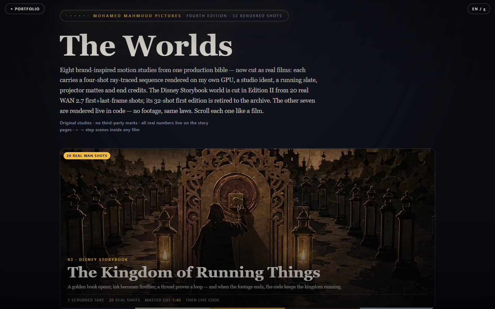

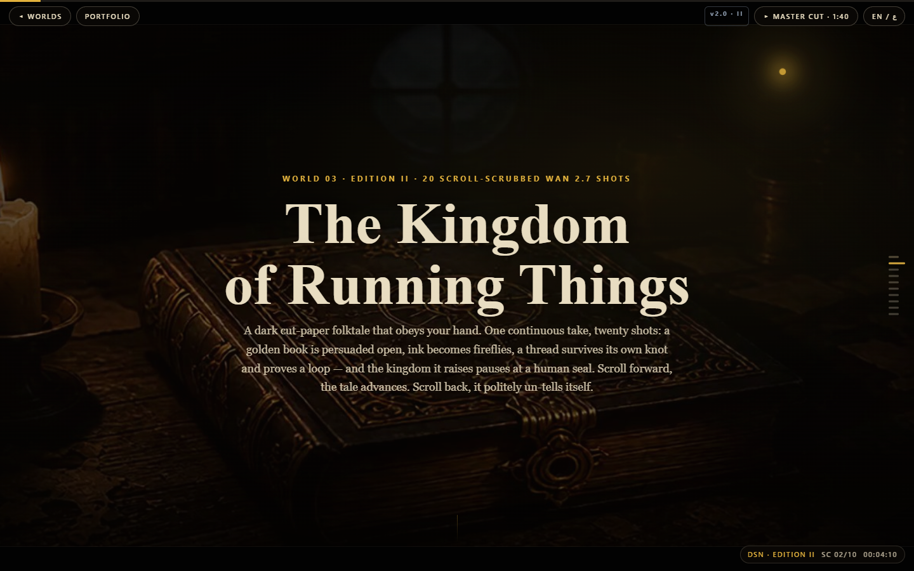

### Desktop: opening, measured join, gate, return, FIN

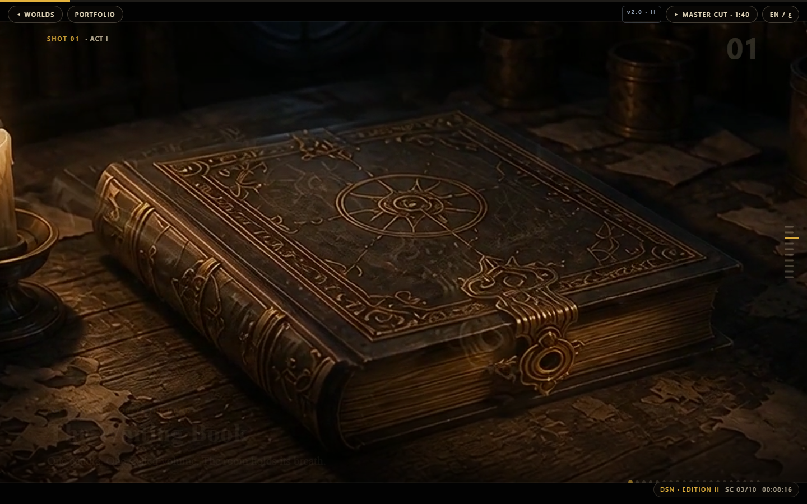

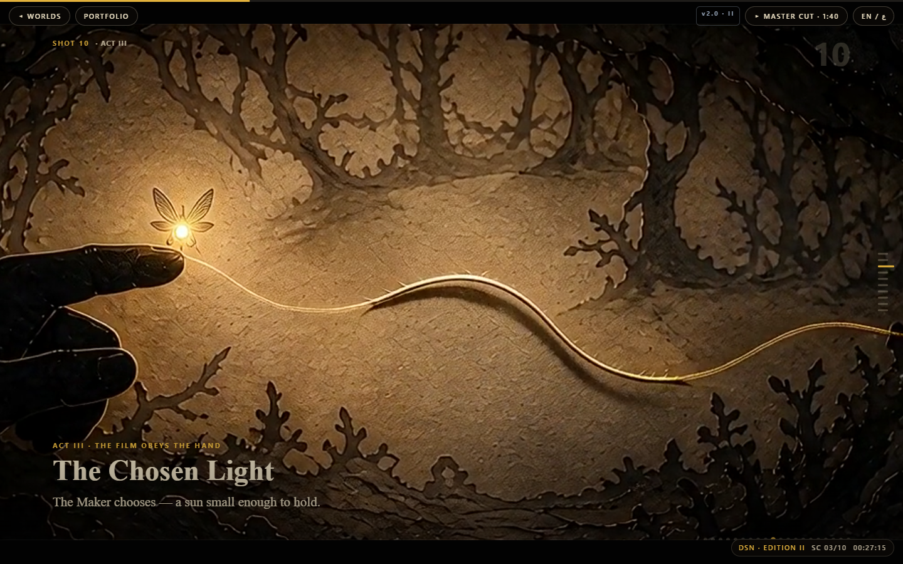

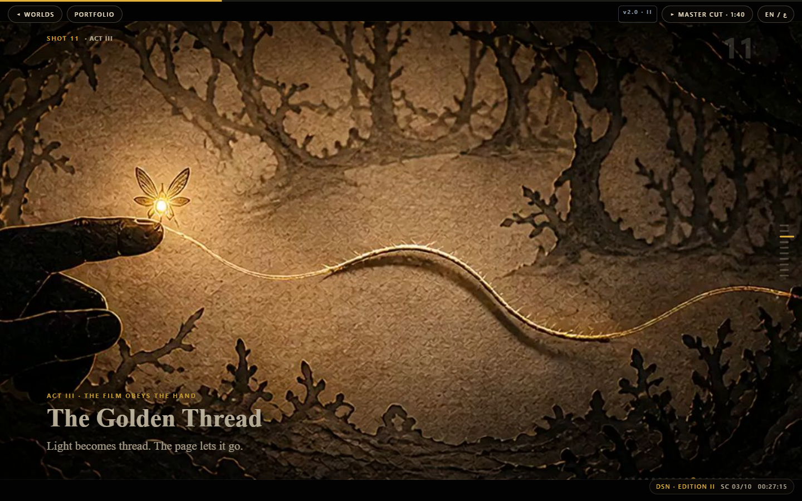

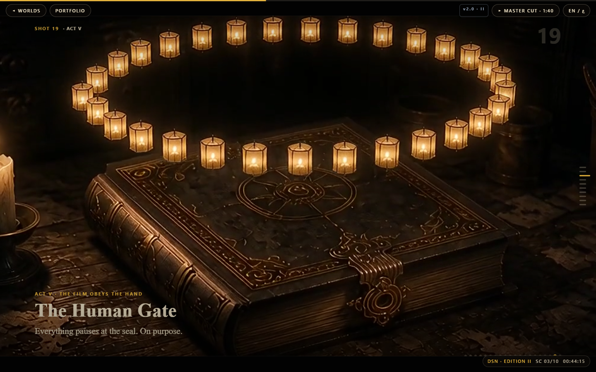

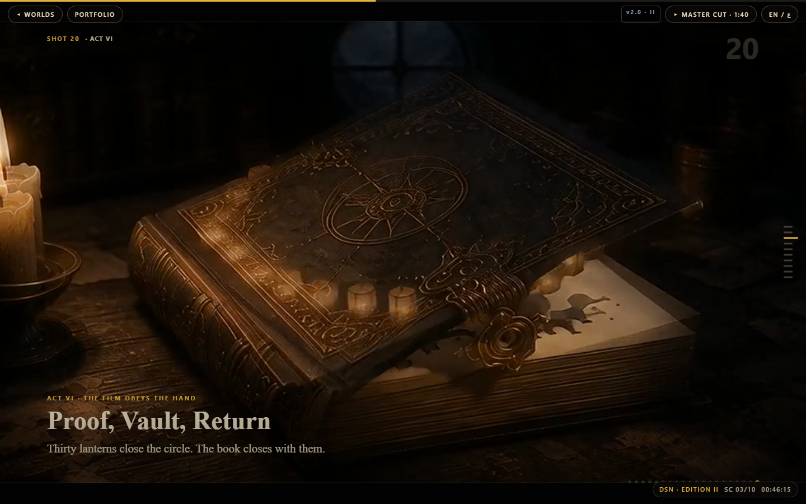

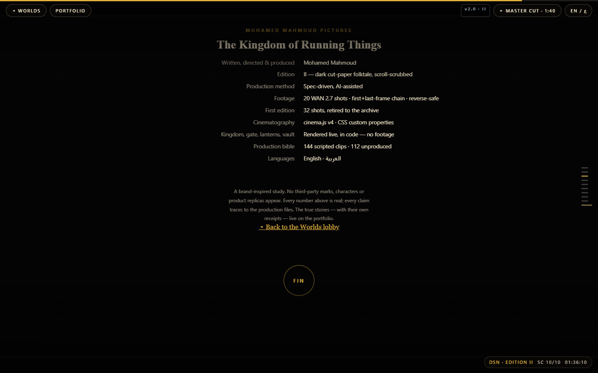

### Phone: opening, measured join, gate, return, FIN

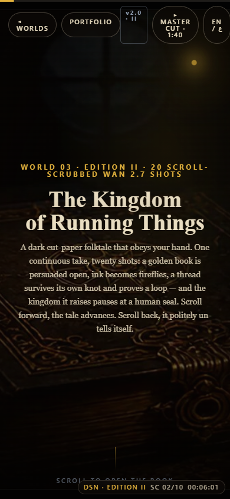

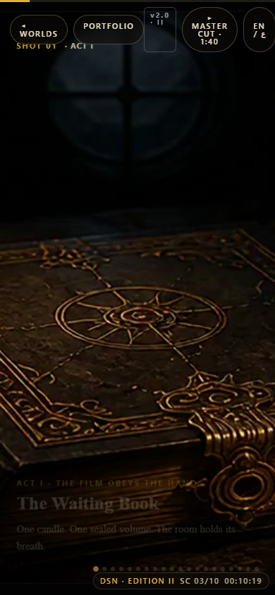

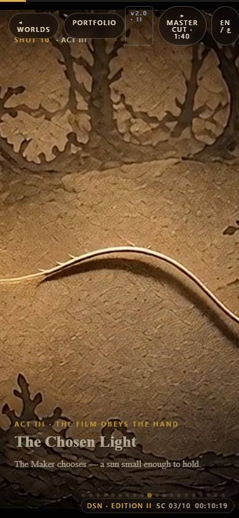

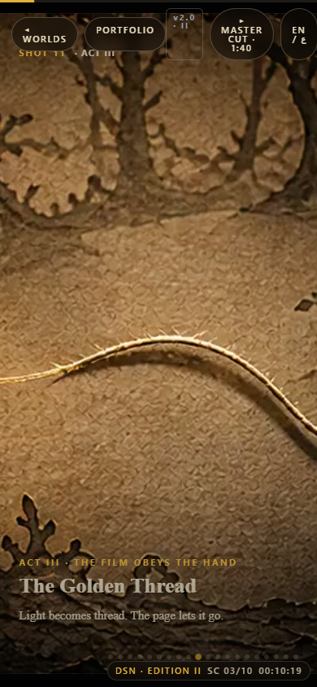

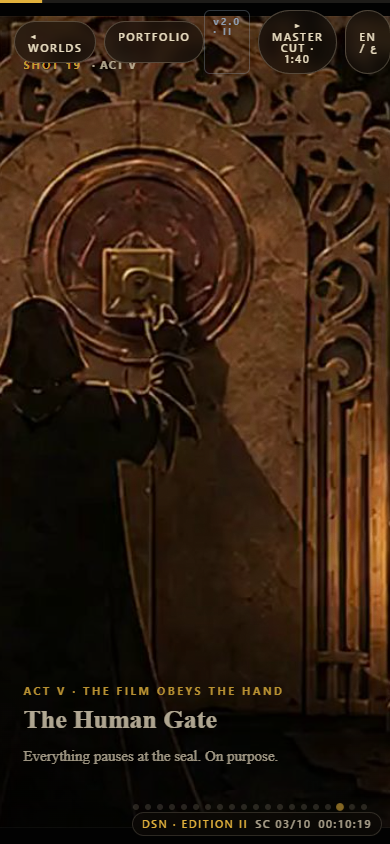

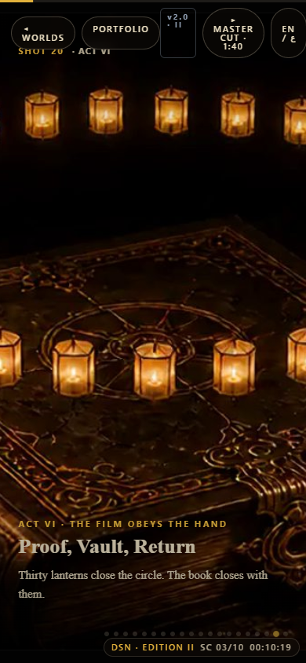

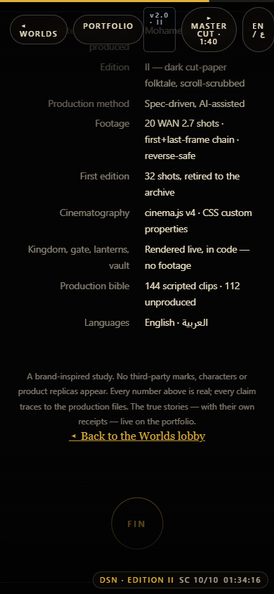
