# The Kingdom of Running Things — Shared Parallax Scroll

Released 2026-08-09: [open the live parallax story](https://mohamed3042.github.io/flagship-portfolio/worlds/disney.html).

This release supersedes Edition II's scrub, coarse-pointer chain, and reduced-motion still modes. The story now has one full-motion parallax experience on desktop, phone, and every motion-preference setting.

## What changed

- **VERIFIED** — Scroll no longer writes `video.currentTime` inside a chapter. Each WAN clip plays on its own clock while scroll chooses the chapter and moves the paper theatre through depth.
- **VERIFIED** — Four ordered physical planes now move on every viewport: distant light, the living film frame, near terrain, and foreground wings. The browser measured 9.36, 27.04, 56.16, and 83.20 px of travel over the same scroll interval.
- **VERIFIED** — Desktop and phone both remain in `mode-parallax`; neither receives a chain, still, or reduced visual system.
- **VERIFIED** — Emulated `prefers-reduced-motion: reduce` keeps both videos displayed, retains all four moving planes, and keeps the candle at its full 3.2 s animation cycle. This is the owner's explicit experience contract for this page.
- **[INFERRED]** — The visual direction is a traveling cut-paper theatre: the movie lives inside a framed book stage while silhouetted scenery crosses in front of and behind it.
- **VERIFIED** — English and Arabic story, lobby, edition, footage, and cinematography copy now describe the parallax journey instead of a scrubbed film.

## Fail-first proof

Before implementation, the dedicated contract gate rejected the old page:

```text
FAIL parallax mode: scene film mode-scrub is-live
FAIL four depth planes: all None
PARALLAX_CONTRACT_FAIL
```

After implementation, the same gate passed the mode, four planes, ordered travel, and independent video clock:

```text
PASS parallax mode
PASS four depth planes
PASS ordered parallax travel: 9.36/27.04/56.16/83.20
PASS scroll does not scrub video: DSN2-010.mp4 t=1.250->1.250
PARALLAX_CONTRACT_PASS
```

## Release proof

- Source: [`5eee84a`](https://github.com/Mohamed3042/flagship-portfolio/commit/5eee84a).
- GitHub Pages tree: [`7658c1c`](https://github.com/Mohamed3042/flagship-portfolio/commit/7658c1c89e408630062b1f52db530062e0572e59), reported `built` by GitHub Pages for that exact commit.
- **VERIFIED** — Production build generated 56 routes; static verification passed 26 stories in English and Arabic.
- **VERIFIED** — The canonical public URL passed [137 browser checks](assets/kingdom-parallax-scroll/verification.json): HTTP 200, byte-range 206, four-plane travel, independent clip time, Arabic, reverse travel, autoplay-blocked phone fallback, full motion under reduced-motion emulation, intact FIN, zero console errors, and zero page exceptions.
- **VERIFIED** — Desktop and phone chapter 10→11 decoded-frame joins both measured 2.8 raw / 8.1 edge, below the 20 / 50 discontinuity limits.
- **VERIFIED** — The rendered stage has no letterboxing: 1371×792 desktop and 379×710 phone, both using the same cover-composed film plane.

## Deployed renders

### Desktop depth travel

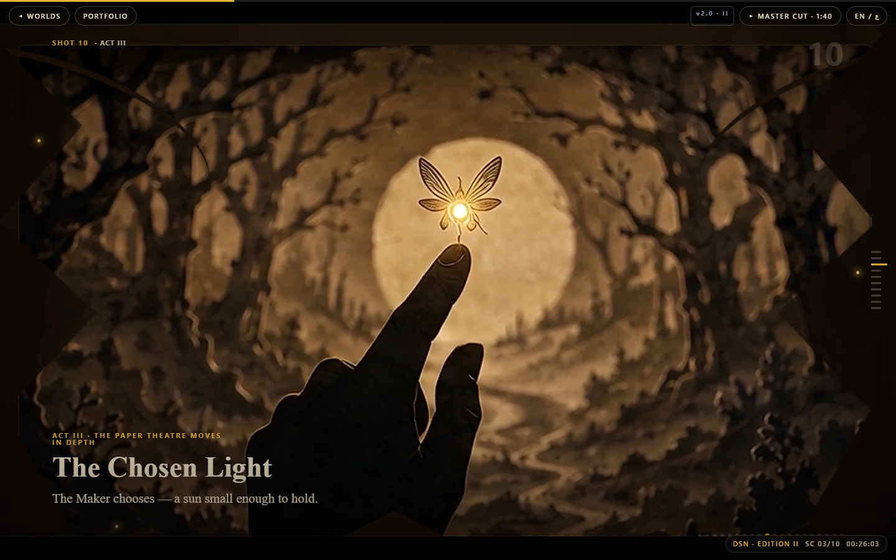

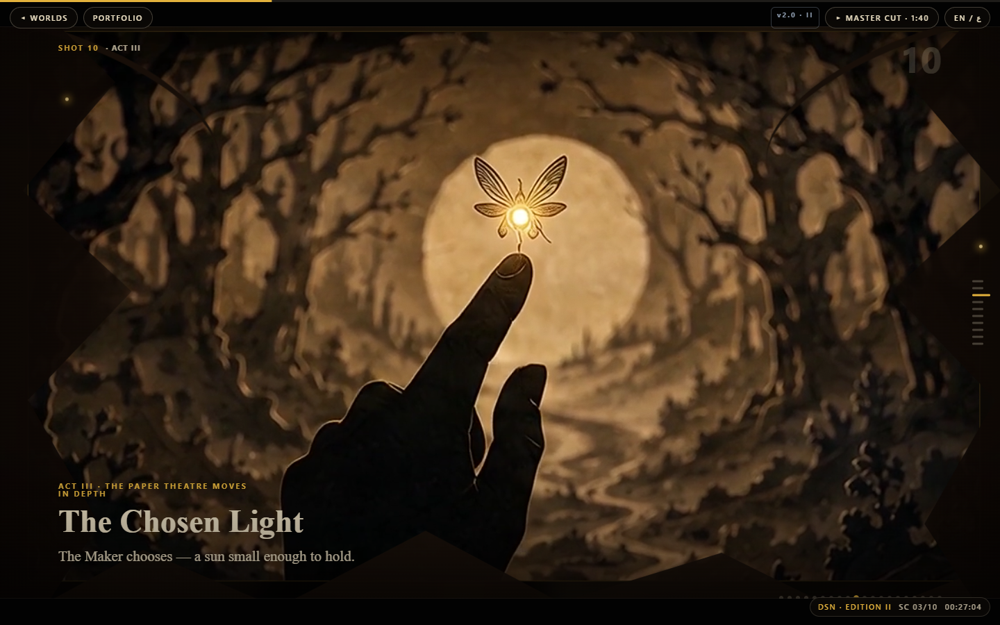

### Phone depth travel — same visual system

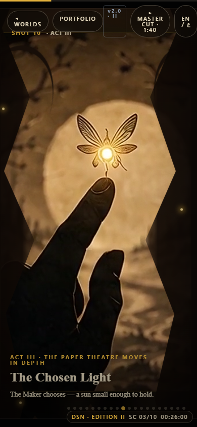

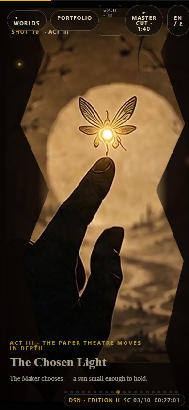

### Story and continuity

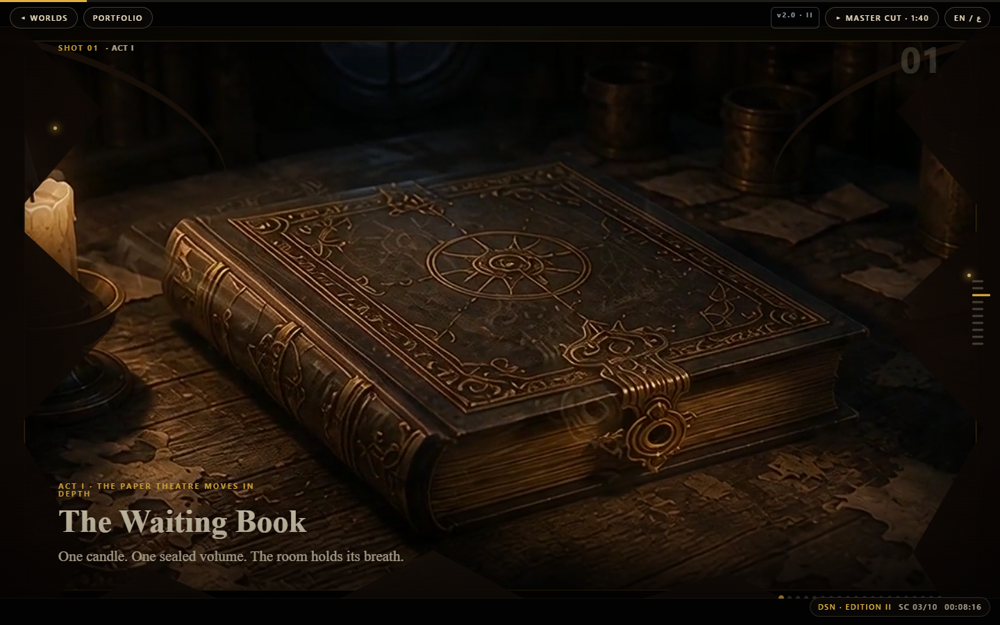

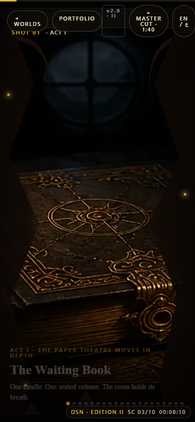

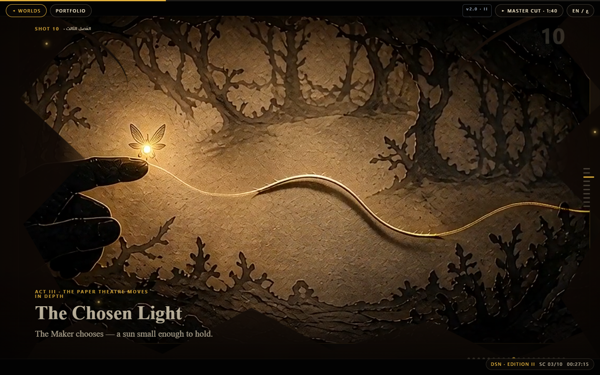

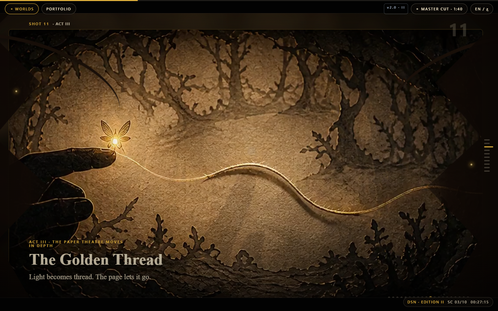

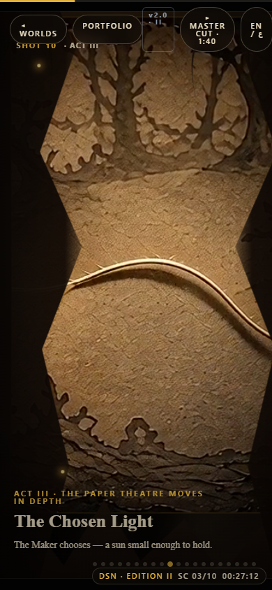

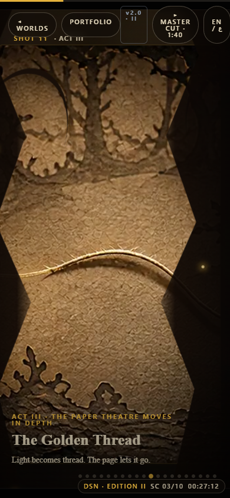

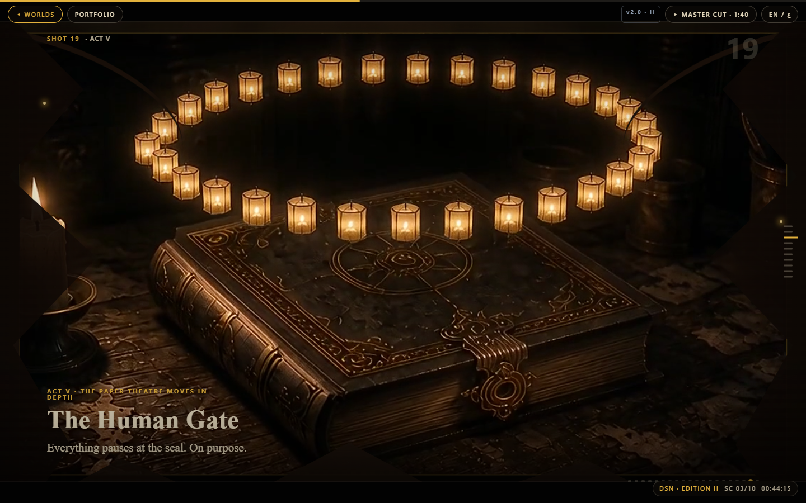

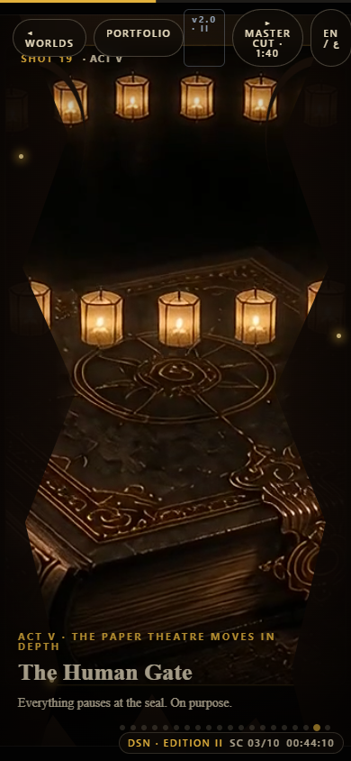

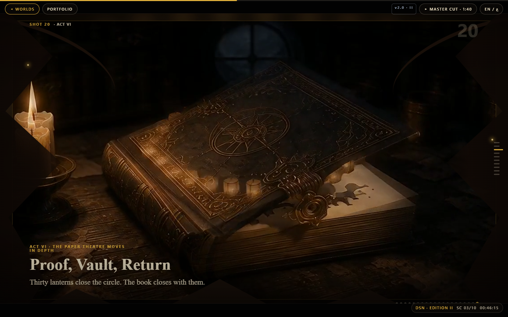

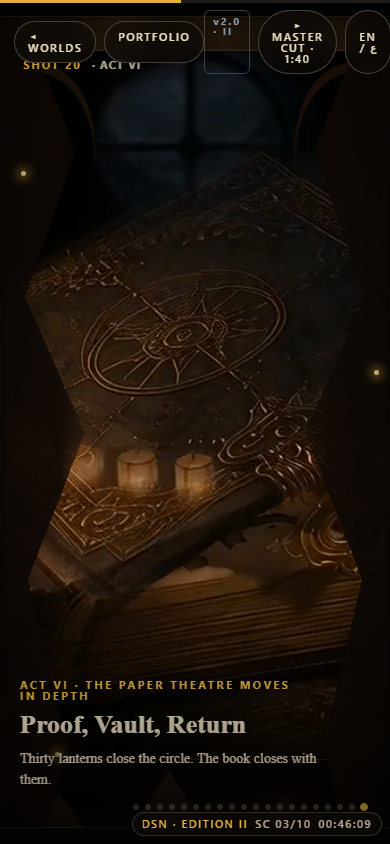

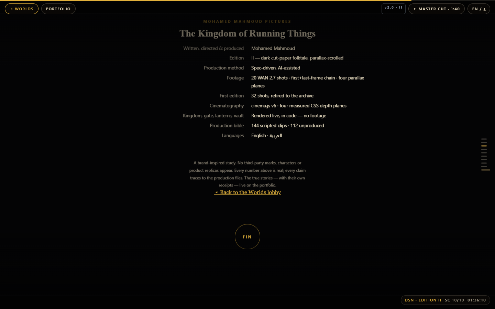

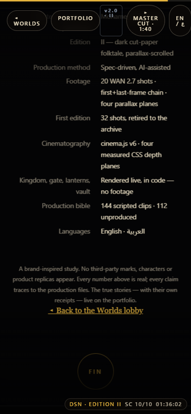

### Worlds lobby

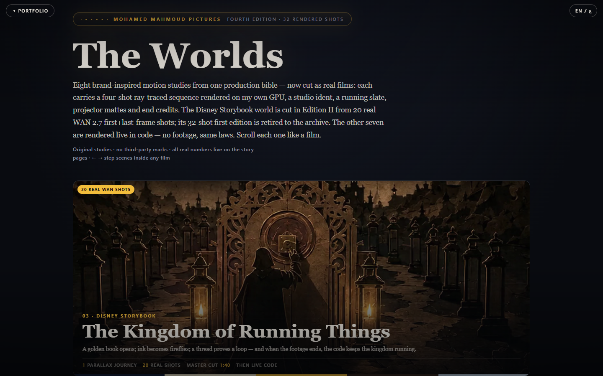
