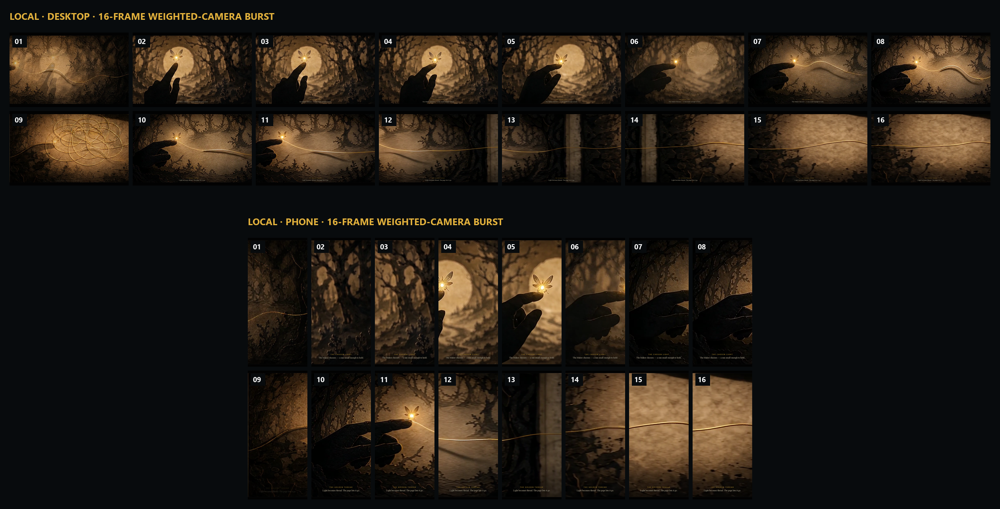
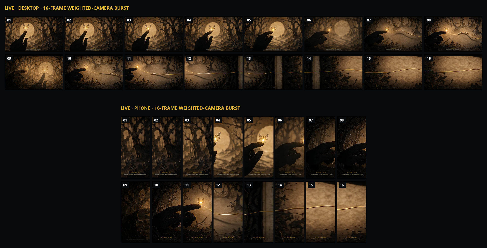
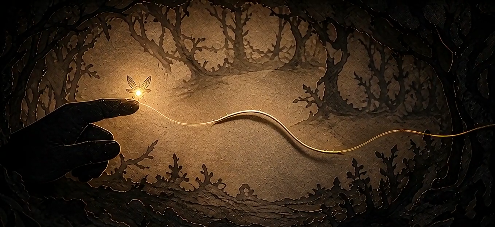
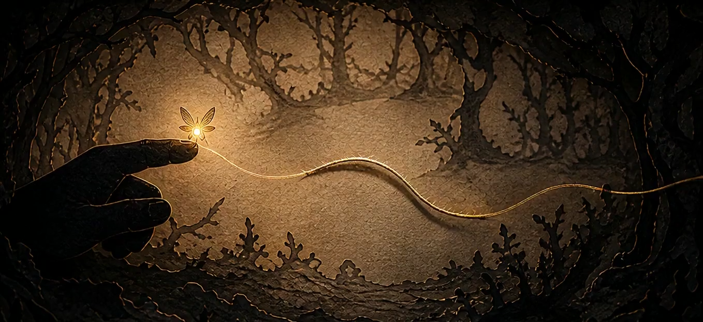

# Kingdom v3.3 — The Weighted Camera

Released: [live Disney world](https://mohamed3042.github.io/flagship-portfolio/worlds/disney.html)

## Outcome

**VERIFIED — shipped.** The Kingdom's scroll signal now drives one time-based, exponentially
smoothed playhead. That single value controls the film clock, horizontal rostrum pan, chapter
depth and whole-journey progress, so the picture has weight without splitting the camera from
the film. Desktop, phone and reduced-motion use the same controller.

The visible release identifies itself as `v3.3 · II` / **The Weighted Camera**. Shared
`cinema.js?v=6`, shared `cinema.css?v=5`, all clip query strings and all media assets remain
unchanged. DSN2-006's known mid-clip story break remains out of scope and untouched.

## Camera contract

- `TAU = 140 ms`; frame-rate-independent response: `1 - exp(-dt / TAU)`.
- One `smoothP` feeds chapter selection, film time, `--pan`, `--depth` and `--journey`.
- Pan uses an arrive / cross / settle grammar: `smoothstep(clamp((f - .12) / .76))`, mirrored
  on odd chapters. Film time remains linear within the chapter.
- Navigation jumps greater than 1.5 chapters snap; ordinary wheel/touch/trackpad movement eases.
- The scene loop parks after three frames inside `1e-4` and rearms on input, resize or scene
  re-entry. Prefetch direction still follows the raw-minus-smoothed gap.
- Both existing video slots, leg arming, seek queue, cue/solo behavior and poster error fallback
  are preserved. Each armed five-second clip is buffered into an object URL so CDN seek latency
  cannot make the displayed film clock lag behind the weighted camera.

**[INFERRED] — tuning call.** `140 ms` sits inside the directed 100–200 ms range. Its mathematical
95% response is about 419 ms; measured response reaches 97.4–98.2% by 500 ms with an 8.6% largest
pan step. This was the shortest setting that still read as a physical camera in the reviewed
desktop and phone dailies. The `.12/.88` parked plateaus keep joins still while leaving 76% of
each chapter for the cross.

## Fail-first proof

The weighted-camera gates were added before the page was changed and run against v3.2.
[That report](assets/kingdom-weighted-camera/fail-first-v32-verification.json) records **23
failures**: one-frame pan/clock jumps, no post-input glide, no idle-park state, raw chapter-edge
motion, the old badge, and loose join behavior.

The first deployed v3.3 also produced a useful RED gate on the real CDN: reduced-motion pan took
81 frames while its asynchronously ranged film seek moved in only three, with a 53.6% clock jump.
Buffering each of the same two armed slots made seeking local; the unchanged lockstep test then
went GREEN on the live URL. No new media, generation credit or service was used.

## Release proof

- **VERIFIED — local:** [236/236 checks](assets/kingdom-weighted-camera/local-verification.json),
  zero page errors and zero `play()` attempts.
- **VERIFIED — deployed:** [236/236 checks](assets/kingdom-weighted-camera/live-verification.json),
  desktop + phone + reduced-motion, zero console/page errors, byte-range transport, Arabic cue
  direction and FIN intact.
- **VERIFIED — step response:** desktop pan/clock spread over 81/83 frames; largest steps
  8.6%/11.2%; 1.8%/2.6% remained at 500 ms; their halfway crossings were both frame 22.
- **VERIFIED — phone:** 81/83 frames; largest steps 8.6%/11.2%; 1.8%/3.1% remained at 500 ms;
  both halfway crossings were frame 22.
- **VERIFIED — steady scroll:** worst per-frame pan was 1.52× median on deployed desktop and
  1.57× on deployed phone, below the 3× gate.
- **VERIFIED — chapter grammar:** even/odd arrivals and settles park at exact opposite edges;
  midpoint pans measured 0.496/0.504. The 10→11 join measured `0.008 → 0.000`.
- **VERIFIED — build/deploy:** production build generated 56 pages; source commits
  [`739350c`](https://github.com/Mohamed3042/flagship-portfolio/commit/739350c) and
  [`b6ac62c`](https://github.com/Mohamed3042/flagship-portfolio/commit/b6ac62c); final Pages tree
  [`91db92d`](https://github.com/Mohamed3042/flagship-portfolio/commit/91db92d).
- **VERIFIED — byte identity:** source, built and Pages HTML share SHA-256
  `0B4F66BB497624F061B69D4EED9ABC856DA18BD1CC5E758CDA4EC3DD92C2338B`.
- **VERIFIED — cost:** 0 credits, 0 generations, 0 paid services.

The only inherited-gate retunes were intentional and stricter where applicable:

1. The pan-sweep sample moved from chapter fractions `.10/.90` to `.15/.85` so it measures the
   moving region rather than the new parked plateaus; the required travel remains at least 60%.
2. Serpentine join continuity tightened from `≤ .12` to `≤ .04` because the new grammar parks
   both sides of the boundary.
3. Harness settling time increased from 260 to 550 ms to observe a complete weighted response;
   no acceptance threshold was relaxed.

## Motion dailies

**VERIFIED — visual review.** Sixteen-frame contact sheets were captured over the same 10→11
chapter traversal on both viewports, locally and after deployment. The reviewed frames show a
held arrival, continuous cross, parked/reversing boundary and held settle; no visible lateral
teleport, zig-zag, black frame, caption duplication or viewport-specific motion fork.

### Local — desktop 1440×900 + phone 390×844

### Deployed — desktop 1440×900 + phone 390×844

### Deployed boundary key stills

| Chapter 10 settle | Chapter 11 arrival |
|---|---|
|  |  |
