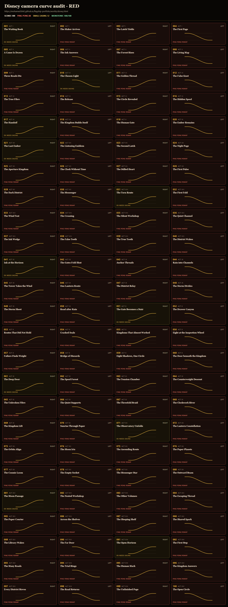
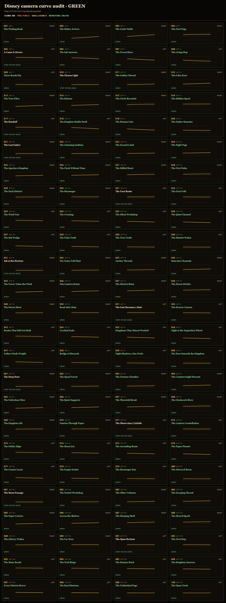
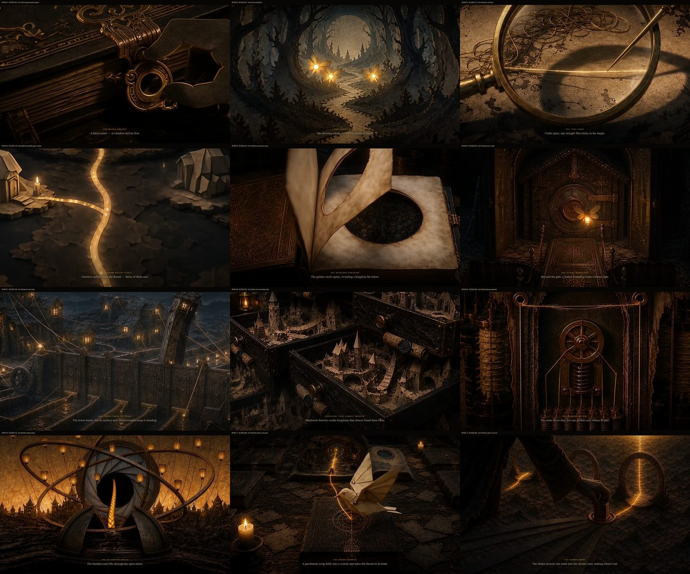
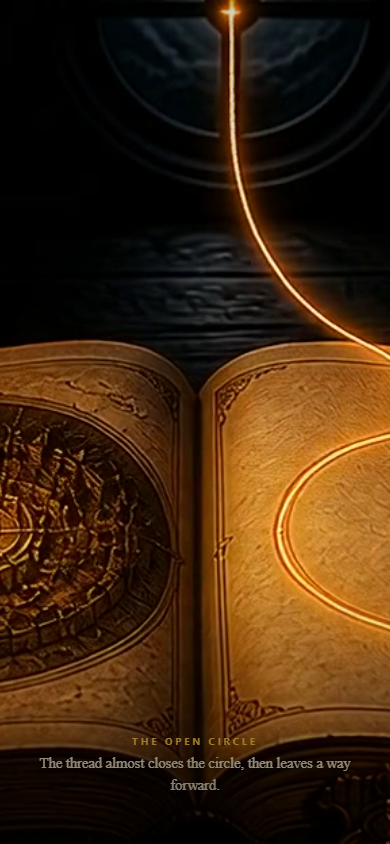

# Disney camera tracking — 2026-08-21

## Outcome

- **VERIFIED — fail-first:** the deployed v4.0 mapping was RED across all 100 scenes: 88 unmotivated ping-pong joins, 88 join-velocity failures, and 12 scenes classified “OK — minor easing” (the opening plus 11 story-motivated returns).
- **VERIFIED — built source:** GREEN across all 100 scenes: 0 ping-pong joins, 0 internal monotonicity failures, and 0 join failures.
- **VERIFIED — local rendered runtime:** desktop 1440×900 and phone 390×844 each visited scenes 1→100 and 100→1, with zero horizontal overflow, zero autoplay calls, 12/12 decoded peak frames, and a clean phone ending.
- **Deployment:** pending the audited main merge and selective `gh-pages` sync; the live receipts below will be filled from the deployed URL.

## Scope boundary

The live Disney Folktale was v4.0 with 100 scenes while `origin/main` still held the earlier 20-scene v3.3 page. The exact shipped v4.0 page (`e577599:public/worlds/disney.html`) was therefore restored into this branch before the surgical mapping edit.

**VERIFIED:** relative to that shipped v4.0 page, the product diff is limited to the camera mapping: 31 insertions and 7 deletions in `public/worlds/disney.html`. The 100 footage URLs, copy, timing, `cinema.js`, and `cinema.css` are unchanged.

## Reproduction and classification

The mapping gate loads each `?solo=N&p=X` scene, applies 101 evenly spaced progress samples, then records the page's actual `--pan`, journey, depth, computed object position, derivative signs, and boundary velocities.

| Gate | Before | Built after |
|---|---:|---:|
| Scenes swept | 100 | 100 |
| Internal curves with >1 derivative sign change | 0 | 0 |
| Unmotivated direction reversals | 88 | 0 |
| Adjacent join failures | 88 | 0 |
| Ping-pong — remap | 88 | 0 |
| OK — minor easing | 12 | 0 |
| Verdict | **RED** | **GREEN** |

The old curve was individually monotonic inside every scene, but odd/even scene parity reversed it at nearly every cut. That is why the defect felt like “left and right without thinking”: it lived at scene hand-offs, not inside the footage.

## Repair

**[INFERRED]:** camera returns now align with narrative block boundaries after scenes 4, 9, 16, 20, 30, 40, 50, 60, 70, 80, and 90. Acts IV–VI remain one camera phrase across scenes 17–20 so three short acts do not create another rapid ping-pong cluster.

The one global track uses quintic smootherstep interpolation through these knots:

`0/.18 → 4/.82 → 9/.24 → 16/.80 → 20/.32 → 30/.78 → 40/.22 → 50/.80 → 60/.20 → 70/.76 → 80/.24 → 90/.78 → 100/.50`

Each scene inherits its segment from the global curve. Non-story joins retain direction and speed; story returns occur at zero boundary velocity; the last scene settles centered. The same deterministic function is used when scrubbing backward.

## Rendered proof

Evidence:

- [Before per-scene measurements](assets/disney-camera-tracking/before/camera-scenes.csv)
- [Before join table](assets/disney-camera-tracking/before/camera-joins.csv)
- [Built-after per-scene measurements](assets/disney-camera-tracking/after-built/camera-scenes.csv)
- [Built-after join table](assets/disney-camera-tracking/after-built/camera-joins.csv)
- [Local browser runtime report](assets/disney-camera-tracking/runtime-local/runtime-browser-verification.json)

## Gate receipts

| Gate | Receipt |
|---|---|
| Fail-first deployed mapping | `CAMERA_GATE_RED scenes=100 ping_pong=88 small_easing=12 internal_failures=0 join_failures=88` |
| Fixed source mapping | `CAMERA_GATE_GREEN scenes=100 ping_pong=0 small_easing=0 internal_failures=0 join_failures=0` |
| `npm run build:ghpages` | `56 page(s) built` |
| Built HTML mapping | `CAMERA_GATE_GREEN scenes=100 ping_pong=0 small_easing=0 internal_failures=0 join_failures=0` |
| Local browser runtime | `DISNEY_CAMERA_RUNTIME_GREEN desktop_forward=100/100 desktop_reverse=100/100 phone_forward=100/100 phone_reverse=100/100 peaks=12/12 phone_ending=GREEN` |
| Deployed mapping | pending |
| Deployed browser runtime | pending |

## Per-scene before/after curve table

| Scene | Act | Title | Before start→end | Owner class | After start→end | After |
|---:|---|---|---|---|---|---|
| 001 | Act I | The Waiting Book | 0.0000 → 1.0000 right | OK — minor easing | 0.1800 → 0.2462 right | GREEN |
| 002 | Act I | The Maker Arrives | 1.0000 → 0.0000 left | PING-PONG — remap | 0.2462 → 0.5000 right | GREEN |
| 003 | Act I | The Latch Yields | 0.0000 → 1.0000 right | PING-PONG — remap | 0.5000 → 0.7537 right | GREEN |
| 004 | Act I | The First Page | 1.0000 → 0.0000 left | PING-PONG — remap | 0.7537 → 0.8200 right | GREEN |
| 005 | Act II | A Cause Is Drawn | 0.0000 → 1.0000 right | OK — minor easing | 0.8200 → 0.7864 left | GREEN |
| 006 | Act II | The Ink Answers | 1.0000 → 0.0000 left | PING-PONG — remap | 0.7864 → 0.6359 left | GREEN |
| 007 | Act II | The Forest Rises | 0.0000 → 1.0000 right | PING-PONG — remap | 0.6359 → 0.4241 left | GREEN |
| 008 | Act II | The Living Map | 1.0000 → 0.0000 left | PING-PONG — remap | 0.4241 → 0.2736 left | GREEN |
| 009 | Act II | Three Roads Die | 0.0000 → 1.0000 right | PING-PONG — remap | 0.2736 → 0.2400 left | GREEN |
| 010 | Act III | The Chosen Light | 1.0000 → 0.0000 left | OK — minor easing | 0.2400 → 0.2530 right | GREEN |
| 011 | Act III | The Golden Thread | 0.0000 → 1.0000 right | PING-PONG — remap | 0.2530 → 0.3210 right | GREEN |
| 012 | Act III | The False Knot | 1.0000 → 0.0000 left | PING-PONG — remap | 0.3210 → 0.4460 right | GREEN |
| 013 | Act III | The True Fibre | 0.0000 → 1.0000 right | PING-PONG — remap | 0.4460 → 0.5940 right | GREEN |
| 014 | Act III | The Release | 1.0000 → 0.0000 left | PING-PONG — remap | 0.5940 → 0.7190 right | GREEN |
| 015 | Act III | The Circle Revealed | 0.0000 → 1.0000 right | PING-PONG — remap | 0.7190 → 0.7870 right | GREEN |
| 016 | Act III | The Hidden Spool | 1.0000 → 0.0000 left | PING-PONG — remap | 0.7870 → 0.8000 right | GREEN |
| 017 | Act IV | The Handoff | 0.0000 → 1.0000 right | OK — minor easing | 0.8000 → 0.7503 left | GREEN |
| 018 | Act IV | The Kingdom Builds Itself | 1.0000 → 0.0000 left | PING-PONG — remap | 0.7503 → 0.5600 left | GREEN |
| 019 | Act V | The Human Gate | 0.0000 → 1.0000 right | PING-PONG — remap | 0.5600 → 0.3697 left | GREEN |
| 020 | Act VI | The Ember Remains | 1.0000 → 0.0000 left | PING-PONG — remap | 0.3697 → 0.3200 left | GREEN |
| 021 | Act VII | The Last Ember | 0.0000 → 1.0000 right | OK — minor easing | 0.3200 → 0.3239 right | GREEN |
| 022 | Act VII | The Listening Emblem | 1.0000 → 0.0000 left | PING-PONG — remap | 0.3239 → 0.3466 right | GREEN |
| 023 | Act VII | The Second Latch | 0.0000 → 1.0000 right | PING-PONG — remap | 0.3466 → 0.3950 right | GREEN |
| 024 | Act VII | The Night Page | 1.0000 → 0.0000 left | PING-PONG — remap | 0.3950 → 0.4660 right | GREEN |
| 025 | Act VII | The Aperture Kingdom | 0.0000 → 1.0000 right | PING-PONG — remap | 0.4660 → 0.5500 right | GREEN |
| 026 | Act VII | The Clock Without Time | 1.0000 → 0.0000 left | PING-PONG — remap | 0.5500 → 0.6340 right | GREEN |
| 027 | Act VII | The Stilled Heart | 0.0000 → 1.0000 right | PING-PONG — remap | 0.6340 → 0.7050 right | GREEN |
| 028 | Act VII | The First Pulse | 1.0000 → 0.0000 left | PING-PONG — remap | 0.7050 → 0.7534 right | GREEN |
| 029 | Act VII | The Dark District | 0.0000 → 1.0000 right | PING-PONG — remap | 0.7534 → 0.7761 right | GREEN |
| 030 | Act VII | The Messenger | 1.0000 → 0.0000 left | PING-PONG — remap | 0.7761 → 0.7800 right | GREEN |
| 031 | Act VIII | The Torn Route | 0.0000 → 1.0000 right | OK — minor easing | 0.7800 → 0.7752 left | GREEN |
| 032 | Act VIII | The First Fold | 1.0000 → 0.0000 left | PING-PONG — remap | 0.7752 → 0.7476 left | GREEN |
| 033 | Act VIII | The Wind Test | 0.0000 → 1.0000 right | PING-PONG — remap | 0.7476 → 0.6887 left | GREEN |
| 034 | Act VIII | The Crossing | 1.0000 → 0.0000 left | PING-PONG — remap | 0.6887 → 0.6022 left | GREEN |
| 035 | Act VIII | The Silent Workshop | 0.0000 → 1.0000 right | PING-PONG — remap | 0.6022 → 0.5000 left | GREEN |
| 036 | Act VIII | The Quiet Channel | 1.0000 → 0.0000 left | PING-PONG — remap | 0.5000 → 0.3978 left | GREEN |
| 037 | Act VIII | The Ink Wedge | 0.0000 → 1.0000 right | PING-PONG — remap | 0.3978 → 0.3113 left | GREEN |
| 038 | Act VIII | The False Teeth | 1.0000 → 0.0000 left | PING-PONG — remap | 0.3113 → 0.2524 left | GREEN |
| 039 | Act VIII | The True Tooth | 0.0000 → 1.0000 right | PING-PONG — remap | 0.2524 → 0.2248 left | GREEN |
| 040 | Act VIII | The District Wakes | 1.0000 → 0.0000 left | PING-PONG — remap | 0.2248 → 0.2200 left | GREEN |
| 041 | Act IX | Ink at the Horizon | 0.0000 → 1.0000 right | OK — minor easing | 0.2200 → 0.2250 right | GREEN |
| 042 | Act IX | The Gates Fold Shut | 1.0000 → 0.0000 left | PING-PONG — remap | 0.2250 → 0.2536 right | GREEN |
| 043 | Act IX | Anchor Threads | 0.0000 → 1.0000 right | PING-PONG — remap | 0.2536 → 0.3146 right | GREEN |
| 044 | Act IX | Rain into Channels | 1.0000 → 0.0000 left | PING-PONG — remap | 0.3146 → 0.4041 right | GREEN |
| 045 | Act IX | The Tower Takes the Wind | 0.0000 → 1.0000 right | PING-PONG — remap | 0.4041 → 0.5100 right | GREEN |
| 046 | Act IX | One Lantern Route | 1.0000 → 0.0000 left | PING-PONG — remap | 0.5100 → 0.6159 right | GREEN |
| 047 | Act IX | The District Relay | 0.0000 → 1.0000 right | PING-PONG — remap | 0.6159 → 0.7054 right | GREEN |
| 048 | Act IX | The Storm Divides | 1.0000 → 0.0000 left | PING-PONG — remap | 0.7054 → 0.7664 right | GREEN |
| 049 | Act IX | The Storm Sheet | 0.0000 → 1.0000 right | PING-PONG — remap | 0.7664 → 0.7950 right | GREEN |
| 050 | Act IX | Road after Rain | 1.0000 → 0.0000 left | PING-PONG — remap | 0.7950 → 0.8000 right | GREEN |
| 051 | Act X | The Gate Becomes a Stair | 0.0000 → 1.0000 right | OK — minor easing | 0.8000 → 0.7949 left | GREEN |
| 052 | Act X | The Drawer Canyon | 1.0000 → 0.0000 left | PING-PONG — remap | 0.7949 → 0.7652 left | GREEN |
| 053 | Act X | Routes That Did Not Hold | 0.0000 → 1.0000 right | PING-PONG — remap | 0.7652 → 0.7022 left | GREEN |
| 054 | Act X | Cracked Seals | 1.0000 → 0.0000 left | PING-PONG — remap | 0.7022 → 0.6095 left | GREEN |
| 055 | Act X | Kingdoms That Almost Worked | 0.0000 → 1.0000 right | PING-PONG — remap | 0.6095 → 0.5000 left | GREEN |
| 056 | Act X | Eight at the Inspection Wheel | 1.0000 → 0.0000 left | PING-PONG — remap | 0.5000 → 0.3905 left | GREEN |
| 057 | Act X | Failure Finds Weight | 0.0000 → 1.0000 right | PING-PONG — remap | 0.3905 → 0.2978 left | GREEN |
| 058 | Act X | Bridge of Discards | 1.0000 → 0.0000 left | PING-PONG — remap | 0.2978 → 0.2348 left | GREEN |
| 059 | Act X | Eight Shadows, One Circle | 0.0000 → 1.0000 right | PING-PONG — remap | 0.2348 → 0.2051 left | GREEN |
| 060 | Act X | The Door beneath the Kingdom | 1.0000 → 0.0000 left | PING-PONG — remap | 0.2051 → 0.2000 left | GREEN |
| 061 | Act XI | The Deep Door | 0.0000 → 1.0000 right | OK — minor easing | 0.2000 → 0.2048 right | GREEN |
| 062 | Act XI | The Spool Forest | 1.0000 → 0.0000 left | PING-PONG — remap | 0.2048 → 0.2324 right | GREEN |
| 063 | Act XI | The Tension Chamber | 0.0000 → 1.0000 right | PING-PONG — remap | 0.2324 → 0.2913 right | GREEN |
| 064 | Act XI | The Counterweight Descent | 1.0000 → 0.0000 left | PING-PONG — remap | 0.2913 → 0.3778 right | GREEN |
| 065 | Act XI | The Unbroken Fibre | 0.0000 → 1.0000 right | PING-PONG — remap | 0.3778 → 0.4800 right | GREEN |
| 066 | Act XI | The Quiet Supports | 1.0000 → 0.0000 left | PING-PONG — remap | 0.4800 → 0.5822 right | GREEN |
| 067 | Act XI | The Threefold Braid | 0.0000 → 1.0000 right | PING-PONG — remap | 0.5822 → 0.6687 right | GREEN |
| 068 | Act XI | The Clockwork River | 1.0000 → 0.0000 left | PING-PONG — remap | 0.6687 → 0.7276 right | GREEN |
| 069 | Act XI | The Kingdom Lift | 0.0000 → 1.0000 right | PING-PONG — remap | 0.7276 → 0.7552 right | GREEN |
| 070 | Act XI | Sunrise Through Paper | 1.0000 → 0.0000 left | PING-PONG — remap | 0.7552 → 0.7600 right | GREEN |
| 071 | Act XII | The Observatory Unfolds | 0.0000 → 1.0000 right | OK — minor easing | 0.7600 → 0.7555 left | GREEN |
| 072 | Act XII | The Lantern Constellation | 1.0000 → 0.0000 left | PING-PONG — remap | 0.7555 → 0.7299 left | GREEN |
| 073 | Act XII | The Orbits Align | 0.0000 → 1.0000 right | PING-PONG — remap | 0.7299 → 0.6752 left | GREEN |
| 074 | Act XII | The Moon Iris | 1.0000 → 0.0000 left | PING-PONG — remap | 0.6752 → 0.5949 left | GREEN |
| 075 | Act XII | The Ascending Route | 0.0000 → 1.0000 right | PING-PONG — remap | 0.5949 → 0.5000 left | GREEN |
| 076 | Act XII | The Paper Planets | 1.0000 → 0.0000 left | PING-PONG — remap | 0.5000 → 0.4051 left | GREEN |
| 077 | Act XII | The Cosmic Loom | 0.0000 → 1.0000 right | PING-PONG — remap | 0.4051 → 0.3248 left | GREEN |
| 078 | Act XII | The Empty Socket | 1.0000 → 0.0000 left | PING-PONG — remap | 0.3248 → 0.2701 left | GREEN |
| 079 | Act XII | The Messenger Star | 0.0000 → 1.0000 right | PING-PONG — remap | 0.2701 → 0.2445 left | GREEN |
| 080 | Act XII | The Outward Beam | 1.0000 → 0.0000 left | PING-PONG — remap | 0.2445 → 0.2400 left | GREEN |
| 081 | Act XIII | The Moon Passage | 0.0000 → 1.0000 right | OK — minor easing | 0.2400 → 0.2446 right | GREEN |
| 082 | Act XIII | The Nested Workshop | 1.0000 → 0.0000 left | PING-PONG — remap | 0.2446 → 0.2713 right | GREEN |
| 083 | Act XIII | The Other Volumes | 0.0000 → 1.0000 right | PING-PONG — remap | 0.2713 → 0.3281 right | GREEN |
| 084 | Act XIII | The Escaping Thread | 1.0000 → 0.0000 left | PING-PONG — remap | 0.3281 → 0.4114 right | GREEN |
| 085 | Act XIII | The Paper Courier | 0.0000 → 1.0000 right | PING-PONG — remap | 0.4114 → 0.5100 right | GREEN |
| 086 | Act XIII | Across the Shelves | 1.0000 → 0.0000 left | PING-PONG — remap | 0.5100 → 0.6086 right | GREEN |
| 087 | Act XIII | The Sleeping Shelf | 0.0000 → 1.0000 right | PING-PONG — remap | 0.6086 → 0.6919 right | GREEN |
| 088 | Act XIII | The Shared Spark | 1.0000 → 0.0000 left | PING-PONG — remap | 0.6919 → 0.7487 right | GREEN |
| 089 | Act XIII | The Library Wakes | 0.0000 → 1.0000 right | PING-PONG — remap | 0.7487 → 0.7754 right | GREEN |
| 090 | Act XIII | The Far Door | 1.0000 → 0.0000 left | PING-PONG — remap | 0.7754 → 0.7800 right | GREEN |
| 091 | Act XIV | The Open Horizon | 0.0000 → 1.0000 right | OK — minor easing | 0.7800 → 0.7776 left | GREEN |
| 092 | Act XIV | The First Step | 1.0000 → 0.0000 left | PING-PONG — remap | 0.7776 → 0.7638 left | GREEN |
| 093 | Act XIV | The Many Roads | 0.0000 → 1.0000 right | PING-PONG — remap | 0.7638 → 0.7343 left | GREEN |
| 094 | Act XIV | The Trial Rings | 1.0000 → 0.0000 left | PING-PONG — remap | 0.7343 → 0.6911 left | GREEN |
| 095 | Act XIV | The Human Mark | 0.0000 → 1.0000 right | PING-PONG — remap | 0.6911 → 0.6400 left | GREEN |
| 096 | Act XIV | The Kingdom Answers | 1.0000 → 0.0000 left | PING-PONG — remap | 0.6400 → 0.5889 left | GREEN |
| 097 | Act XIV | Every District Moves | 0.0000 → 1.0000 right | PING-PONG — remap | 0.5889 → 0.5457 left | GREEN |
| 098 | Act XIV | The Road Returns | 1.0000 → 0.0000 left | PING-PONG — remap | 0.5457 → 0.5162 left | GREEN |
| 099 | Act XIV | The Unfinished Page | 0.0000 → 1.0000 right | PING-PONG — remap | 0.5162 → 0.5024 left | GREEN |
| 100 | Act XIV | The Open Circle | 1.0000 → 0.0000 left | PING-PONG — remap | 0.5024 → 0.5000 left | GREEN |
