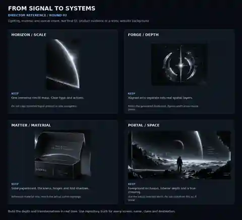

# Signal: visual director pack / Round 02

**Start with [DIRECTOR_HANDOFF.md](DIRECTOR_HANDOFF.md).** The pinned direction is *From Signal to Systems*.

The reference boards were generated earlier in the conversation. This delivery packages those existing images, adds material studies, and binds them to the current source inspection. It is not a new generation run or a claim that the design is implemented.

## Contents

| File | Purpose |
|---|---|
| DIRECTOR_HANDOFF.md | Specific creative direction and observed implementation gaps. |
| IMPLEMENTER_PROMPT.md | Copy-ready next-session instruction. |
| REVIEW_PROTOCOL.md | GitHub exchange, role ownership, evidence and release rules. |
| replies/IMPLEMENTER_REPLY_TEMPLATE.md | Structured implementer response. |
| ASSET_MANIFEST.json | Board origins, generation IDs, dimensions, hashes and exclusions. |
| PREVIEW.webp | Compact online contact board; not a pixel-fidelity target. |
| boards/ and studies/ (download pack) | Four native 1672 x 941 PNG artboards and detail crops. |
| DIRECTOR_REFERENCE_BOARD.jpg (download pack) | Larger annotated reference board. |

Full-resolution PNGs, crops and the larger JPG are supplied in the `signal-director-pack.zip` conversation download. The GitHub docs and compact preview are sufficient to start the directed code pass; obtain the full pack before a high-resolution visual comparison. Do not enlarge the preview and call it a native-resolution comp.

**Important:** invented Signal/Atlas/Tide project labels, generated UI figures and extra navigation inside the artboards are not approved content. Keep repository truth and existing destinations. These are material/composition references, not final screens.

## Collaboration

Use the accompanying draft PR as the shared discussion. Label comments `DIRECTOR / Round 02` or `IMPLEMENTER / Round 02`. Agents read it when invoked; GitHub does not automatically relay private chats or run the next agent. See REVIEW_PROTOCOL.md.

This branch changes documentation/reference material only. It does not publish the implementer's working tree, alter the live site or authorize deployment.
