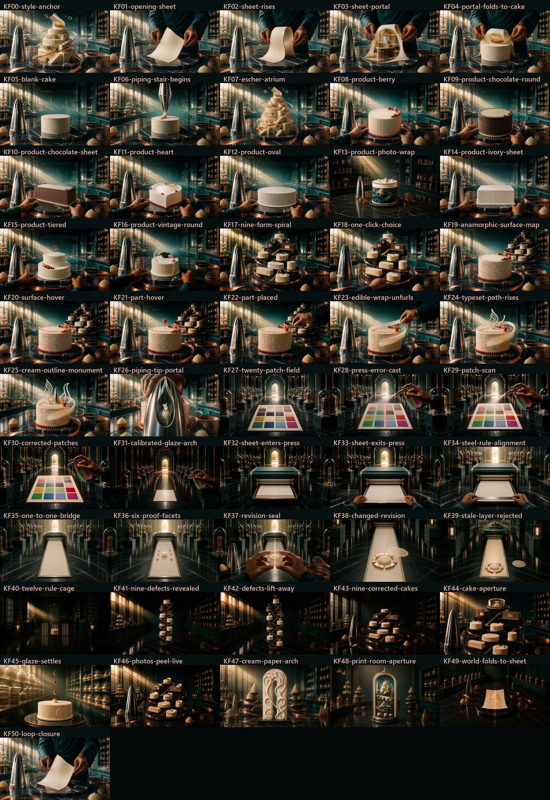
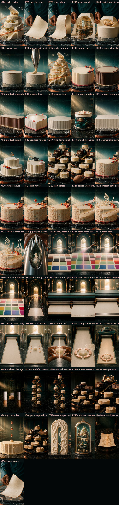

# Cake Studio keyframe gate

## Outcome

- **VERIFIED:** 51/51 final PNGs exist in sequence KF00–KF50.
- **VERIFIED:** every final is exactly 1920×1088; automated QA reports zero errors.
- **VERIFIED:** desktop editorial pass: 51/51.
- **VERIFIED:** strict 9:16 center-cover editorial pass: 51/51.
- **VERIFIED:** all eight prior holds were regenerated and cleared after desktop and portrait review.
- **VERIFIED:** no generated video files exist and WAN video-credit spend is 0.
- **VERIFIED (manual visual review):** no readable claims, labels, logos, or watermarks remain in final pixels.
- **[LOST]:** automated OCR evidence is unavailable because no OCR engine is installed.

## Regeneration results

| Frame | Desktop | Strict 9:16 cover | Resolved finding |
|---|---:|---:|---|
| KF13 | pass | pass | The lower cake wall now reads unmistakably as a wordless edible photo wrap with a visible physical seam. |
| KF31 | pass | pass | Exactly 20 calibrated droplets form one complete arch in both crops. |
| KF40 | pass | pass | Exactly 12 inspection beams appear as three countable groups of four, fully retained in portrait. |
| KF41 | pass | pass | Exactly nine cakes and nine complete landings are visible; each cake carries a restrained readable fault. |
| KF42 | pass | pass | Exactly nine cakes, nine floating fault pieces, and nine one-to-one correction beams remain visible. |
| KF43 | pass | pass | Exactly nine corrected cakes and all landings remain visible; inspection beams are absent. |
| KF46 | pass | pass | Exactly nine cakes and nine upward-peeling sheets remain fully visible with wordless miniature still lifes. |
| KF49 | pass | pass | The complete embossed sheet now has an unmistakable raised front-edge curl and preserves the central light seam. |

## Count locks verified in final frames

| Gate | Result |
|---|---|
| KF17 product spiral | 9 cakes |
| KF27–KF30 calibration field | 20 patches, 4×5 |
| KF31 calibrated arch | 20 droplets |
| KF36 proof facets | 6 facets |
| KF37 revision seal | 6 segments |
| KF40 inspection cage | 12 beams, 3 groups of 4 |
| KF41 defect source | 9 cakes, 9 landings |
| KF42 correction beat | 9 cakes, 9 lifted faults, 9 beams |
| KF43 corrected FLF | 9 cakes |
| KF45 glaze beat | 3 droplets |
| KF46 finale peel | 9 cakes, 9 sheets |
| KF50 loop reflection | 6 visible facets, 3 per side |

## Evidence

- `keyframe-qa.json` — sequence, dimensions, hashes, luminance, and edge statistics.
- `CST-contact-sheet-master.png` — all 51 desktop compositions.
- `CST-contact-sheet-portrait-master.png` — all 51 strict 9:16 center-cover compositions.
- Failed count/framing generations are preserved locally as `REJECT-*.png` but excluded from the Git review payload.

### Desktop master

### Strict 9:16 master

## Approval gate

The Phase-1 still set is ready for Mohamed's explicit `APPROVE STILLS`. No WAN video generation, motion work, page implementation, or deployment may begin before that approval. The GitHub branch contains review artifacts only.
