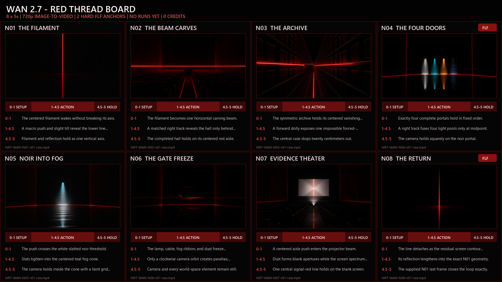

# THE ANTHOLOGY - Red Thread Cut - WAN 2.7 comparison board

**Status:** Generation-ready board only. No WAN calls were made and no credits were spent.

| Contract | Value |
|---|---|
| Product | WAN 2.7 image-to-video |
| Delivery | 8 shots, 5 seconds each, 720p, 16:9 |
| Input | Exact 1920x1080 center crop of each accepted master, Lanczos-scaled to 1280x720 |
| Motion | One dominant action plus one camera move |
| Landing | Motion settled by 4.5 seconds; final 0.5 seconds stable |
| Prompt extension | Disabled |
| Hard FLF anchors | N04 act bridge; N08 loop closure |
| Current usage | 0 calls, 0 clips, 0 seconds, 0 credits |
| Planned allowance | 80 credits zero-retake; 120 credits total plan |

## Execution bindings

- N04 is a hard first/last-frame act bridge. Its first frame remains **[LOST]** until the accepted N03 landing exists; its destination frame is `inputs/NRT-WAN-N04-keyframe-1280x720.png`.
- N08 is a hard first/last-frame loop closure. Its first frame is N08 and its exact last frame is `inputs/NRT-WAN-N01-keyframe-1280x720.png`.
- The remaining shots use their board inputs as approved image-to-video references; accepted continuation frames are bound only during execution.
- The fixed family seeds are **[INFERRED]** production controls. They have not been submitted to WAN.

## Fair comparison to Grok

Compare each complete WAN 5-second output against the predetermined `00:05.000-00:10.000` window of its 15-second Grok Imagine 2.0 counterpart. Normalize both to 1280x720, mute both, retain every raw output, and score the same seven criteria in the run manifest. Do not cherry-pick a different Grok window after seeing results.

## Run gate

Do not submit anything until the Phase 1 still approval phrase is received. When unlocked, copy the exact prompt file, use the recorded seed, keep `prompt_extend: false`, record the provider task ID, and preserve both accepted and rejected raw outputs.
